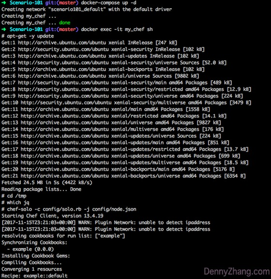

[](https://www.linkedin.com/in/dennyzhang001) [](https://www.dennyzhang.com/slack) [](https://github.com/DennyZhang)

File me [tickets](https://github.com/DennyZhang/chef-study/issues) or star [the repo](https://github.com/DennyZhang/chef-study).

<a href="https://github.com/DennyZhang?tab=followers"></a>

Table of Contents
=================

   * [Requirements](#requirements)
   * [Procedure](#procedure)


<a href="https://www.dennyzhang.com"></a>

# Requirements
```
1. Use docker container to start a env with chef pre-installed
2. Create a dummy cookbook and apply it
```

# Procedure

- Start docker-compose env

docker-compose up -d

- Login to the container, and run procedure
```
docker exec -it my_chef sh
apt-get -y update

cd /tmp

- Before chef apply, jq package is missing
which jq

- From config/node.json, we specify to apply example cookbook
chef-solo -c config/solo.rb -j config/node.json

- After chef apply, jq package is installed
which jq
```

- Destroy docker-compose env after testing

```
docker-compose down -v
```
<a href="https://www.dennyzhang.com"></a>
