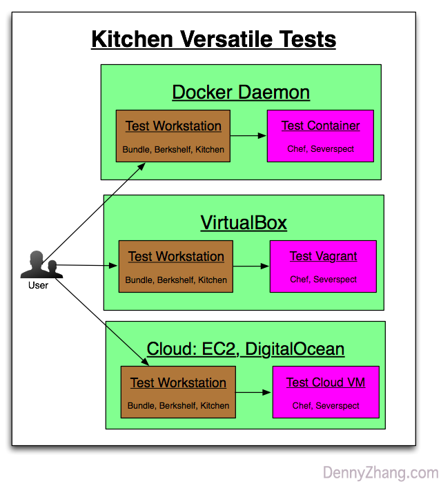

[](https://www.linkedin.com/in/dennyzhang001) [](https://www.dennyzhang.com/slack) [](https://github.com/DennyZhang)

File me [tickets](https://github.com/DennyZhang/chef-study/issues) or star [the repo](https://github.com/DennyZhang/chef-study).

<a href="https://github.com/DennyZhang?tab=followers"></a>

Table of Contents
=================

   * [Requirements](#requirements)
   * [Procedure](#procedure)
      * [Common Setup](#common-setup)
      * [kitchen docker deployment](#kitchen-docker-deployment)
      * [kitchen digitalocean deployment](#kitchen-digitalocean-deployment)
      * [kitchen ec2 deployment](#kitchen-ec2-deployment)
      * [kitchen vagrant deployment](#kitchen-vagrant-deployment)



<a href="https://www.dennyzhang.com"></a>

# Requirements
1. Use Kitchen to test local vm deployment
2. Use Kitchen to test docker deployment
3. Use Kitchen to test cloud VM deployment

# Procedure
## Common Setup
- Install bundle
```
apt-get install ruby-dev

ruby --version
# https://github.com/bundler/bundler/issues/4065
sudo gem install bundler -n /usr/local/bin

bundle --version
```

- Install gem depenencies
```
cd cookbooks/example
bundle install
```

## kitchen docker deployment
- Run kitchen test
```
# https://github.com/test-kitchen/kitchen-docker
kitchen converge
kitchen list
kitchen verify
kitchen destroy
```

## kitchen digitalocean deployment
```
# https://github.com/test-kitchen/kitchen-digitalocean
cd cookbooks/example
export KITCHEN_YAML=".kitchen_digitalocean.yml"

# Customize this with your credential
export DIGITALOCEAN_ACCESS_TOKEN="1234"
export DIGITALOCEAN_SSH_KEY_IDS="1234, 5678"

kitchen converge
kitchen list
kitchen verify
kitchen destroy

- TODO: how does the ssh key work? With which OS user, and where the key is?
```

## kitchen ec2 deployment
- Install AWS cli and configure aws credential
```
# http://docs.aws.amazon.com/cli/latest/userguide/installing.html
pip install awscli
aws configure
```

- Install and run kitchen-ec2
```
# https://github.com/test-kitchen/kitchen-ec2
# https://github.com/test-kitchen/kitchen-ec2/blob/master/lib/kitchen/driver/ec2.rb
cd cookbooks/example
export KITCHEN_YAML=".kitchen_ec2.yml"
# TODO: customize this
export AWS_SSH_KEY_ID="my_ssh_key_id"

kitchen converge
kitchen list
kitchen verify
kitchen destroy
```

## kitchen vagrant deployment

<a href="https://www.dennyzhang.com"></a>
