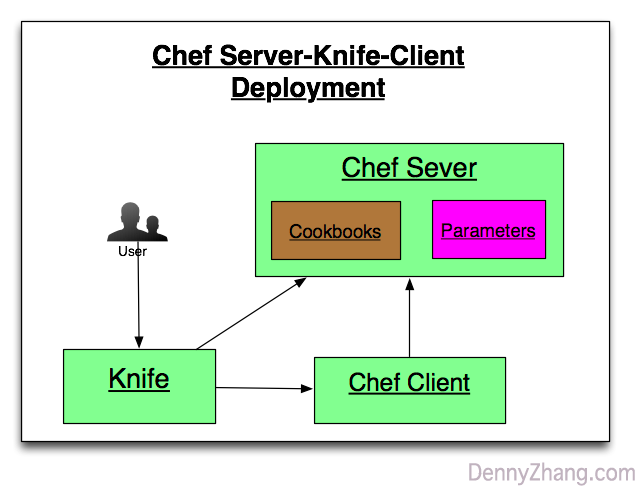

[](https://www.linkedin.com/in/dennyzhang001) [](https://www.dennyzhang.com/slack) [](https://github.com/DennyZhang)

File me [tickets](https://github.com/DennyZhang/chef-study/issues) or star [the repo](https://github.com/DennyZhang/chef-study).

<a href="https://github.com/DennyZhang?tab=followers"></a>

Table of Contents
=================

   * [Requirement](#requirement)
   * [Start docker-compose env](#start-docker-compose-env)
   * [Login to the container, and run procedure](#login-to-the-container-and-run-procedure)
   * [Apply Chef update](#apply-chef-update)
   * [Verify Jenkins](#verify-jenkins)
   * [Destroy docker-compose env after testing](#destroy-docker-compose-env-after-testing)
   * [More Resources](#more-resources)


<a href="https://www.dennyzhang.com"></a>

# Requirement

1. Setup standalone jenkins server
2. Install plugin: ThinBackup, slack
3. Install job: serverspec, rubocop check for git repo

# Start docker-compose env
docker-compose up -d

# Login to the container, and run procedure
```
docker exec -it my_chef sh

mkdir -p /tmp/berks_cookbooks

cd /tmp/cookbooks/jenkins-demo/
berks vendor /tmp/berks_cookbooks
ls -lth /tmp/berks_cookbooks
```

# Apply Chef update
```
cd /tmp
# From config/node.json, we specify to apply example cookbook
chef-solo -L chef_solo.log -c config/solo.rb -j config/node.json

# After deployment, jenkins is up and running
```

# Verify Jenkins
curl -I http://localhost:8080

# Destroy docker-compose env after testing

```
docker-compose down -v
```

# More Resources
- jenkins cookbook: https://github.com/chef-cookbooks/jenkins
<a href="https://www.dennyzhang.com"></a>
